<h1>🗓 Evently</h1>

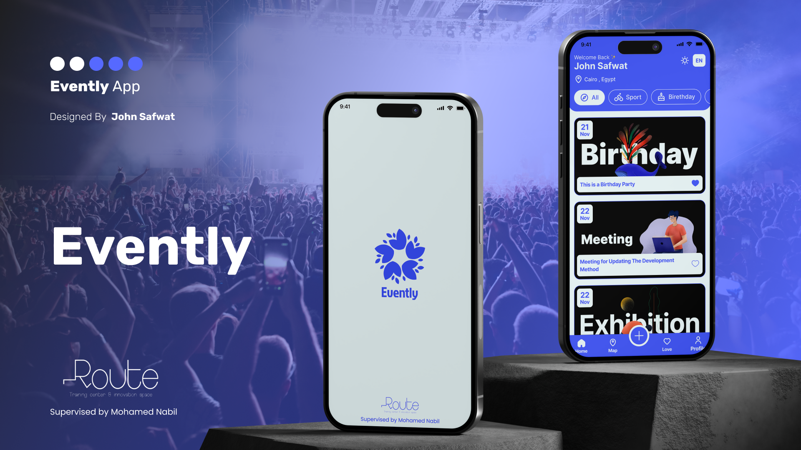

<b>Evently</b> is a modern Flutter application that allows users to create, manage, and organize their events .  
The app includes authentication, profile customization, and full CRUD operations for events — making it perfect for managing daily activities and important occasions. 📅✨

<h2>🚀 Features</h2>

<ul>
  <li>
    <b>Authentication System</b>
    <ul>
      <li>Sign up & login using <b>Email & Password</b></li>
      <li>Sign in with <b>Google Account</b> 🔐</li>
    </ul>
  </li>

  <li>
    <b>Home & Events Management</b>
    <ul>
      <li>Add new events (Title, Description, Date & Time, Category) 📌</li>
      <li>View all events in a clean and organized UI</li>
    </ul>
  </li>

  <li>
    <b>Favorites System</b>
    <ul>
      <li>Mark/unmark events as <b>Favorite</b> ⭐</li>
      <li>Dedicated screen for favorite events</li>
    </ul>
  </li>

  <li>
    <b>Edit & Delete Events</b>
    <ul>
      <li>Edit event details easily ✏️</li>
      <li>Delete events instantly 🗑️</li>
    </ul>
  </li>

  <li>
    <b>Profile Screen</b>
    <ul>
      <li>Change profile picture 🖼️</li>
      <li>Switch between <b>Dark / Light mode</b> 🌙☀️</li>
      <li>Change application language 🌍</li>
    </ul>
  </li>
</ul>

<h2>📸 Screenshots</h2>

<table>
  <tr>
    <td>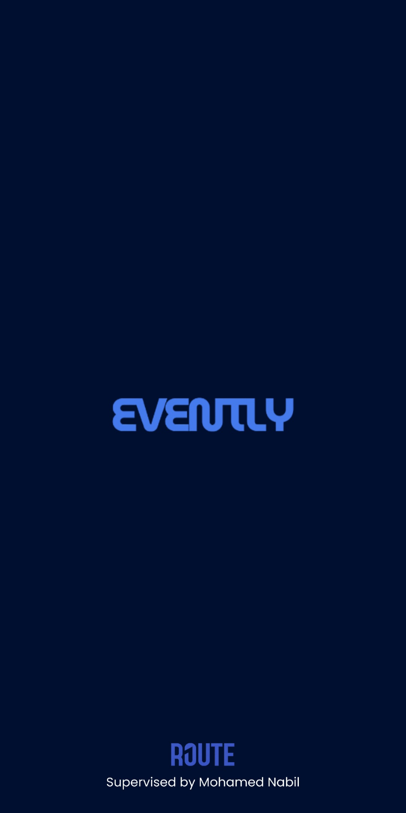</td>
    <td>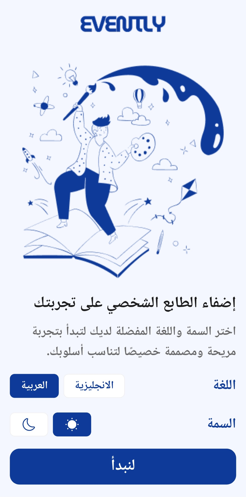</td>
    <td></td>
  </tr>
  <tr>
    <td></td>
    <td>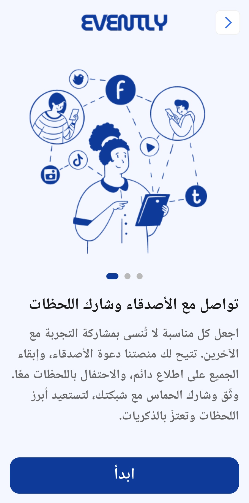</td>
    <td>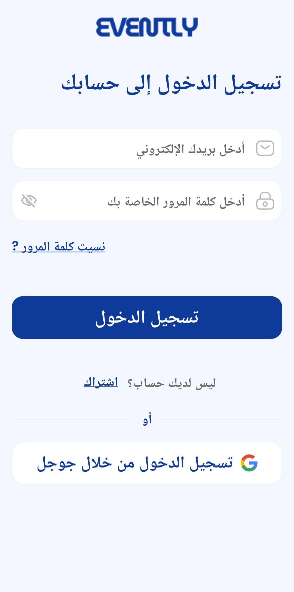</td>
  </tr>
  <tr>
    <td>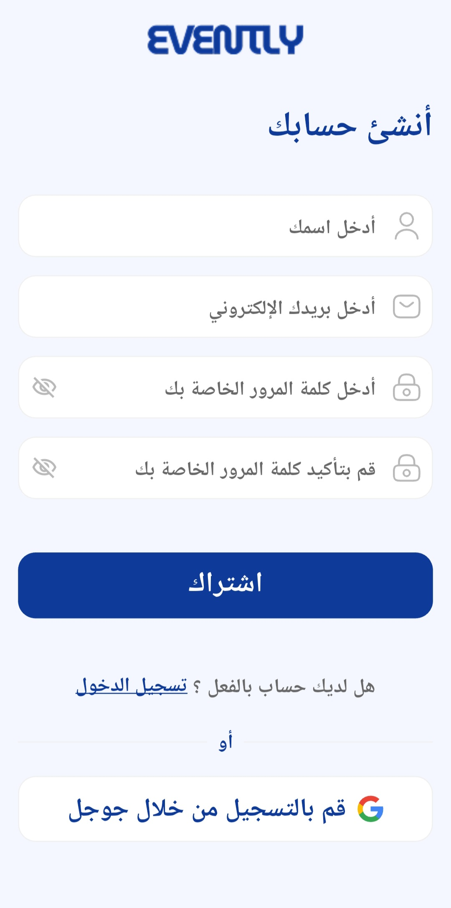</td>
    <td>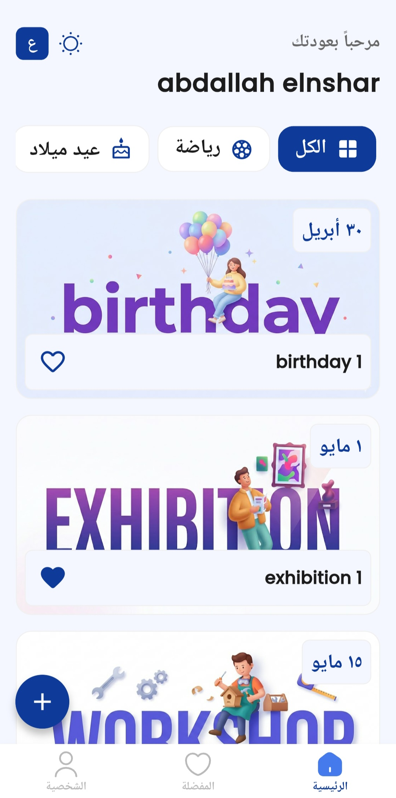</td>
    <td>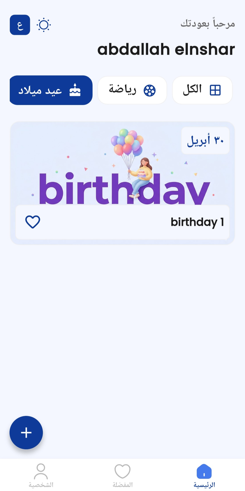</td>
  </tr>
  <tr>
    <td>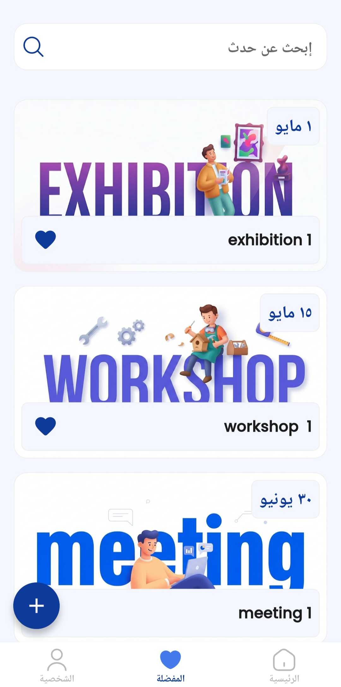</td>
    <td>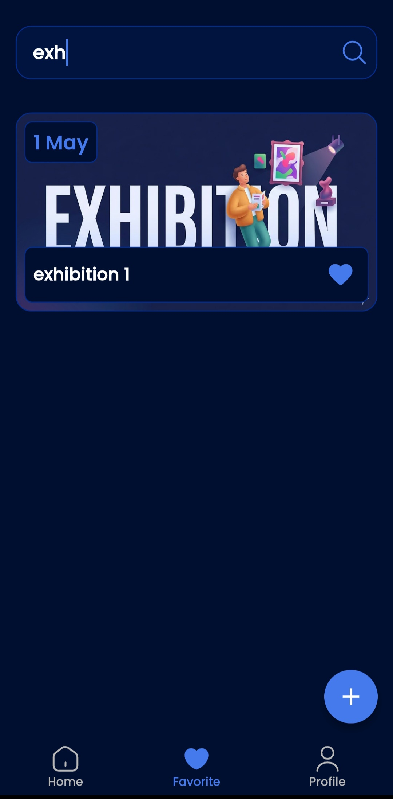</td>
    <td>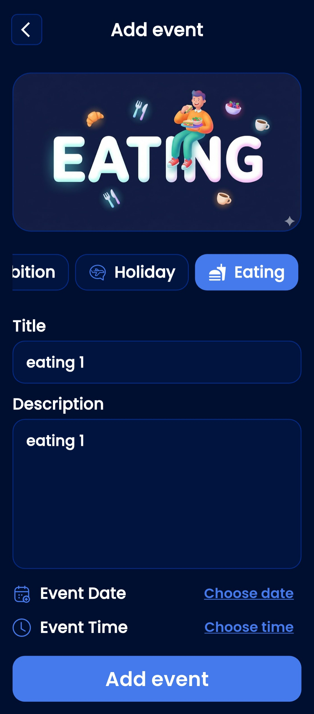</td>
  </tr>
  <tr>
    <td>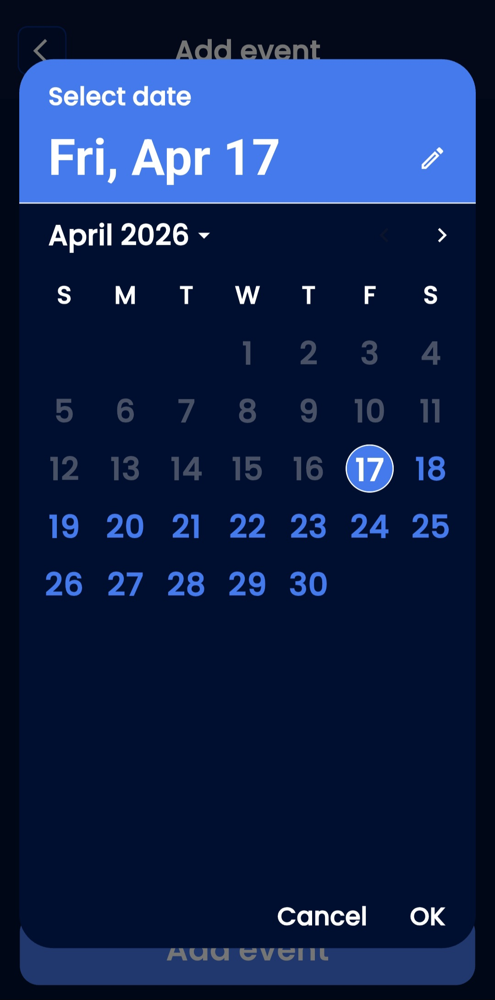</td>
    <td>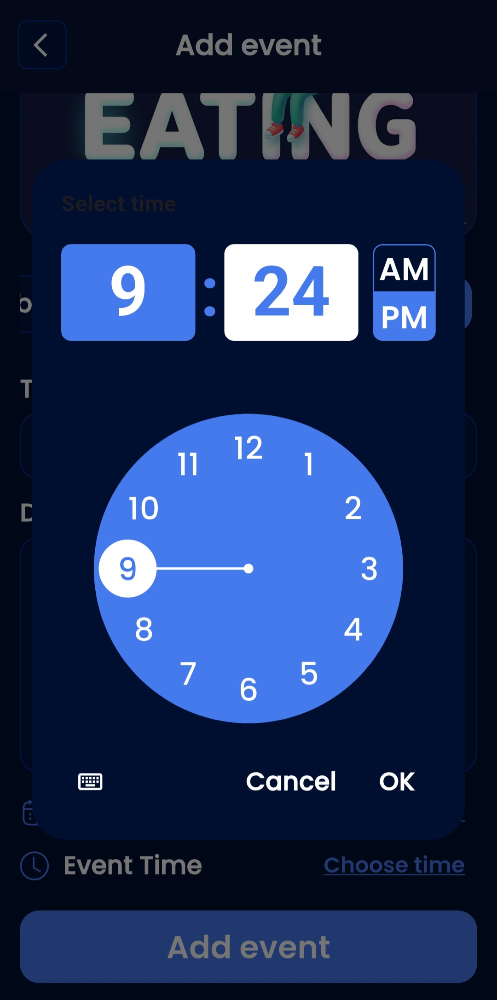</td>
    <td>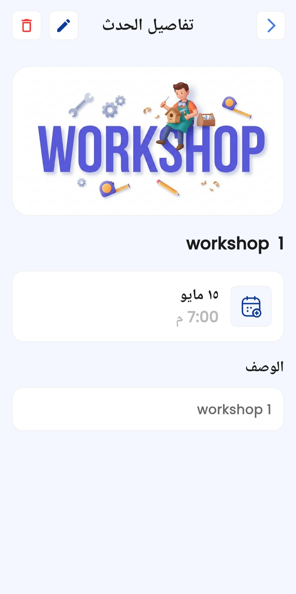</td>
  </tr>
  <tr>
    <td>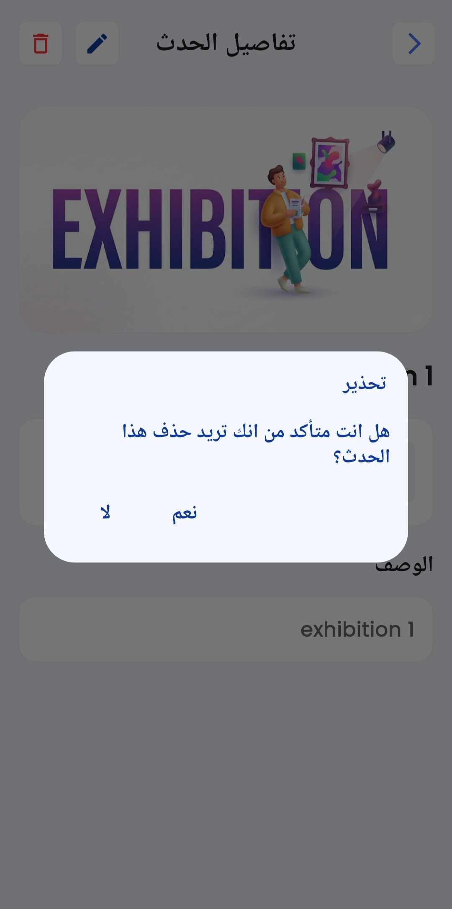</td>
    <td></td>
    <td>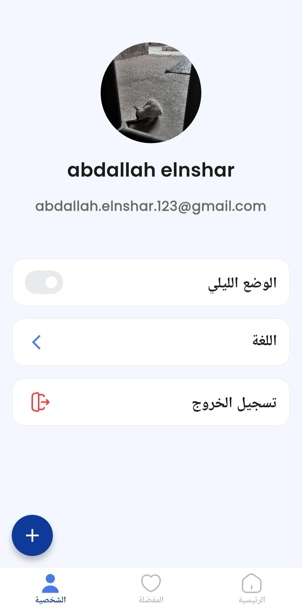</td>
  </tr>
    <tr>
    <td>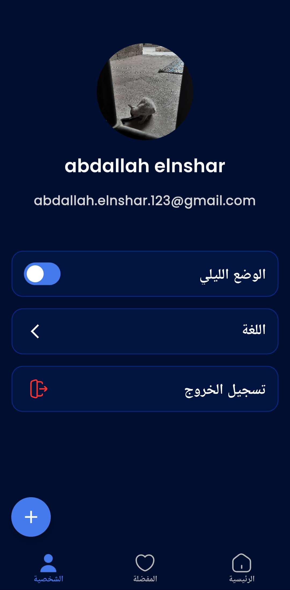</td>
    <td>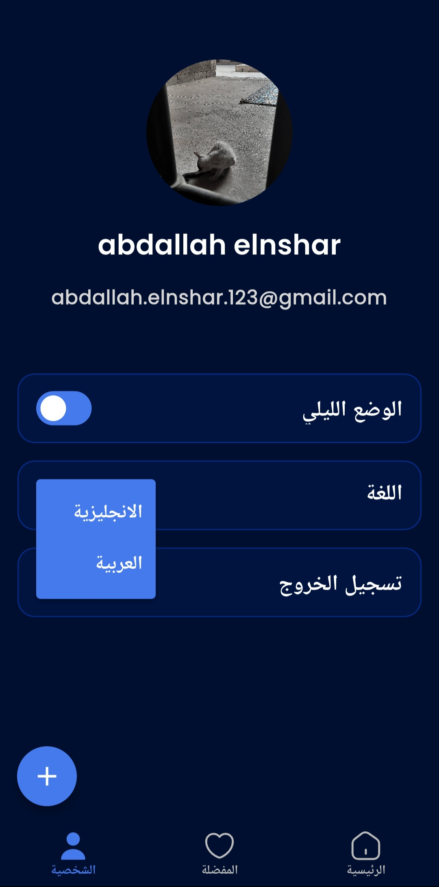</td>
    <td>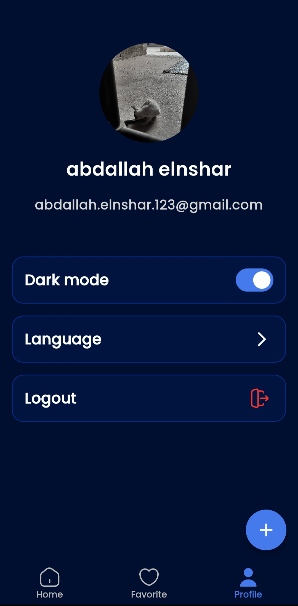</td>
  </tr>
</table>

<h2>📦 Packages Used</h2>

<h3>🎨 UI & Design</h3>
<ul>
  <li><b>flutter_svg</b> - Display SVG icons and assets.</li>
  <li><b>toggle_switch</b> - Used for theme & language switching.</li>
</ul>

<h3>🌍 Localization</h3>
<ul>
  <li><b>easy_localization</b> - Multi-language support داخل التطبيق.</li>
</ul>

<h3>🧠 State Management</h3>
<ul>
  <li><b>provider</b> - Manage app state (user, theme, language, events).</li>
</ul>

<h3>💾 Local Storage</h3>
<ul>
  <li><b>shared_preferences</b> - Store settings like theme and language.</li>
</ul>

<h3>🔥 Firebase & Authentication</h3>
<ul>
  <li><b>firebase_auth</b> - Email & Password authentication.</li>
  <li><b>google_sign_in</b> - Google login integration.</li>
  <li><b>cloud_firestore</b> - Store events data (CRUD).</li>
</ul>

<h3>🖼️ Media Handling</h3>
<ul>
  <li><b>image_picker</b> - Pick profile image from gallery.</li>
  <li><b>cached_network_image</b> - Load and cache images efficiently.</li>
</ul>

<h3>📁 File & Path</h3>
<ul>
  <li><b>path_provider</b> - Access device storage.</li>
  <li><b>path</b> - Handle file paths.</li>
</ul>

<h3>🔐 Permissions</h3>
<ul>
  <li><b>permission_handler</b> - Manage permissions (gallery, etc.).</li>
</ul>

<h2>🛠 Installation & Run</h2>

<pre>
git clone https://github.com/abdallahelnshar123-ux/evently.git
cd evently
flutter pub get
flutter run
</pre>

<h2>👨‍💻 Author & License</h2>

**Abdallah Samir Elnshar**

This app is part of a series of projects developed during my journey at **Route Academy**.  
Thank you for checking out my work! 🙏

This project is open source and available under the **MIT License**.
